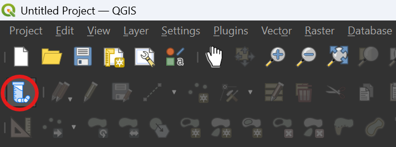
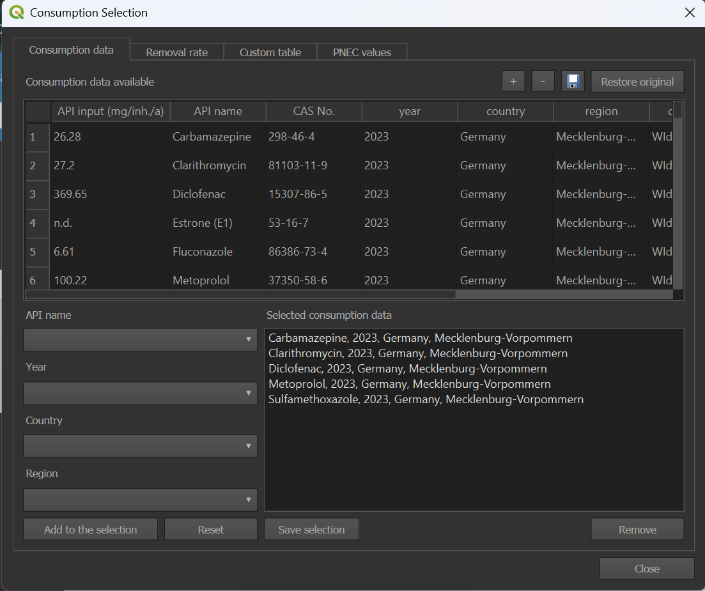
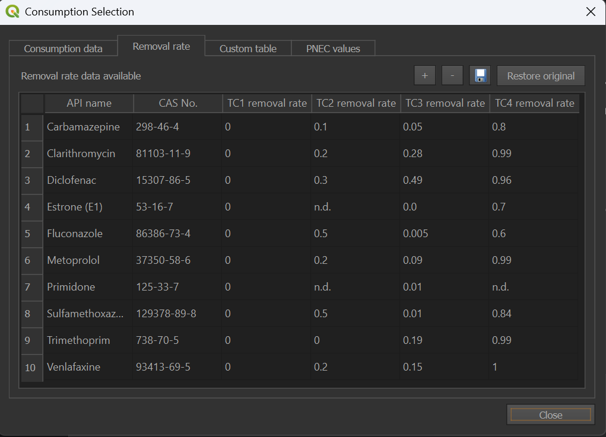
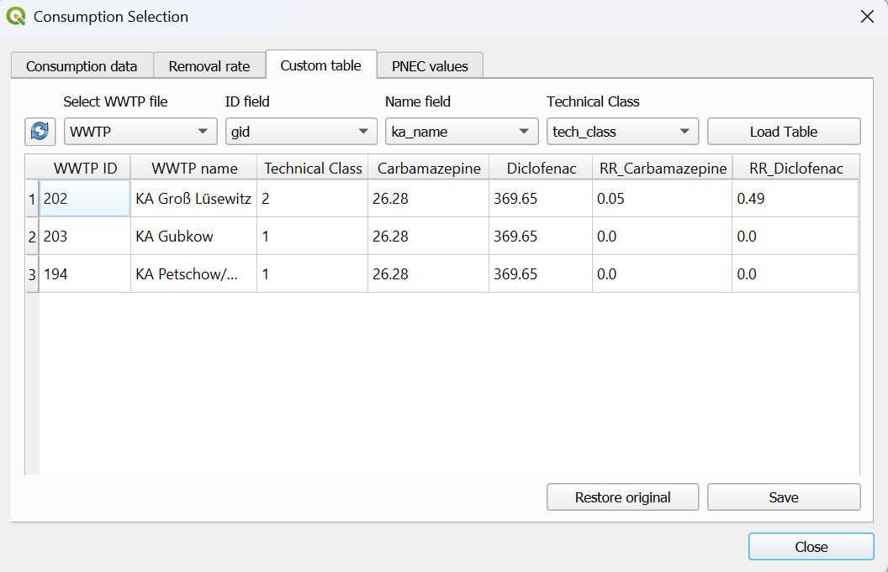
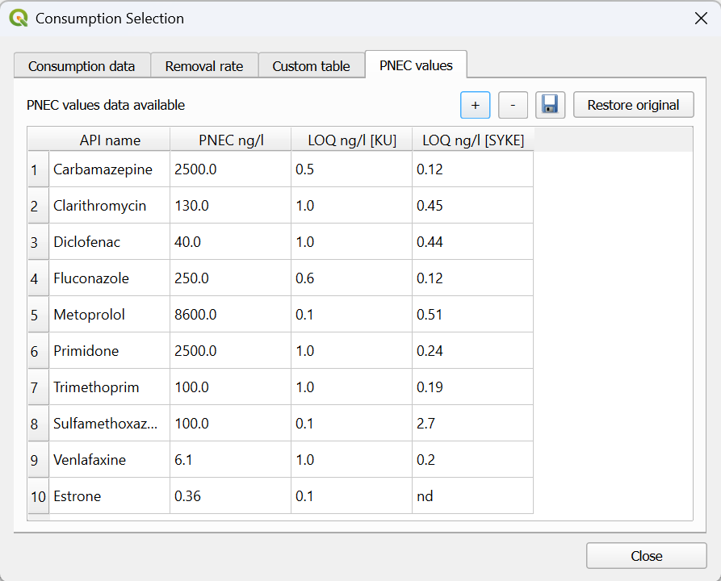

.. _API_Emission:

API Emission
============

The *API Emission* provides a set of tools where the user can calculate the load of certain APIs at different WWTPs and
perform the risk assessment in each river section within a catchment. 

This group of tools is divided in 4 different processes:

* :ref:`consumption-selection`
* :ref:`emission-loads`
* :ref:`accumulation`
* :ref:`risk-assessment`

.. _consumption-selection:

Consumption Selection
----------------------
This tool is giving the user the access to the APRIORA's internal database related to consumption data, removal rates and PNEC values.
Since it is not a processing tool, the user cannot find it under the *Processing Toolbox*. It is displayed instead under *Plugins* --> *Consumption Selection* or
in the Menu Toolbar (see picture below).

The tool contains 4 different windows:

* Consumption data
* Removal rate
* Custom table
* PNEC values

In the next paragraphs, the functionalities of each windows are described. More detailed instruction on how to use them can be found in the video-tutorial 
in the **Workflow** section below.

| **Consumption data**
| Here the user can explore the consumption data related to several substances, with different spatial and temporal coverage. The consumption data is expressed in 
 *mg/inh./a* and it is already including the excretion rate from the human body. When a regional coverage is not available, it is marked as "-" and the national
 value is considered instead. The consumption values are calculated with the formula :math:numref:`consumption_equation`:

.. math::
    :label: consumption_equation

    m_{i,y} = ((m_{cp,y} + m_{cs,y}) \cdot e)/n_{pop}
    

With:

- :math:`m_{i,y}` = yearly consumption of y API [:math:`mg/inh/a`]
- :math:`m_{cp,y}` = yearly prescribed API intake [:math:`kg/a`]
- :math:`m_{cs,y}` = yearly sold over-the-counter API intake [:math:`kg/a`]
- :math:`e` = API specific excretion rate [-]
- :math:`n_{pop}` = population in the reference area for intake data  [-]

| In case the user would like to add a new substance in the database or the same substance but with a different coverage, it is possible to
 do it by clicking on the "+" icon. A new row is added at the bottom of the table and the user should fill out the cells with important information like: API input, API name,
 year, country and region. The other fields can be kept empty. In case a wrongful substance is added, it is possible to select it and then remove it with the "-" icon. When 
 all the changes have been applied, click on the save icon. If the user would like to go back to the core table, simply click on "Restore original".

| **Removal rate**
| This window contains a table with the removal rates of different APIs for the 4 different types of treatment: TC1 (primary treatment), screening and sedimentation; TC2 
 (secondary treatment), aeration and bacterial digestion; TC3 (tertiary treatment), nutrient removal, filtration and chlorine/UV; TC4 (quaternary treatment), activated
 carbon and reverse osmosis. This table provides cumulative removal rates for each treatment stage. This means the value for a given stage (e.g., TC3) already includes 
 the combined removal efficiency of all previous stages (TC1 and TC2). Therefore the calculation is direct and not sequential.
| With a similar logic like before, the user can add a new substance (or edit the current value) by clicking on the "+" icon. After making a change, remember to click
 on the save icon.

| **Custom table**
| In case the user would like to further customize the input data like consumption and removal rates at a more detailed level, here it is possible to do it. By selecting the
 WWTPs shapefile and the correct fields for ID, name and technical class, it is possible to display the consumption values and removal rates for each WWTPs included in the 
 shapefile. By doing so, the user can edit a consumption values or a removal rate for that specific WWTP. After doing any edit, click on the *Save* button. 

| **PNEC values**
| This window contains a table with the PNEC values of different APIs expressed in ng/L. With a similar logic like before, the user can add a new substance 
 (or edit the current value) by clicking on the "+" icon. After making a change, remember to click on the save icon.
 As mere information, limit of quantification (LOQ) of two different laboratories are included: Kristianstad University (Sweden) and SYKE (Finland).

Input data
^^^^^^^^^^
For this tool no input data is required. All the necessary input data (e.g., consumption values, removal rates, PNEC values) are already provided. If the user would like 
to add their own input data, it is possible to do so as previously described. In case the user would like to change consumption values and removal rates at the WWTPs emission 
points, it is necessary to add in the QGIS project a shapefile containing emission points of WWTPs with fields dedicated to id, WWTP name, connected inhabitants and 
technical class (number from 1 to 4).

(write something in case the user has a table that wants to integrate)

Workflow
^^^^^^^^
**Consumption data**

1. Click on the *Consumption Selection* icon in the menu toolbar or go under *Plugins* --> *Consumption Selection*
2. Go on the "Consumption data" window
3. Explore the database and find the APIs that you are interested in (e.g., Carbamazepine and Diclofenac for 2023, Germany, MV)
4. Select the substances by filling out correctly the "API name", "Year", "Country" and "Region" fields
5. Click on "Add to the selection" and the substance will be added in the "Selected consumption data" window
6. Repeat the steps 3 - 5 with all the interested APIs
7. Click on "Save selection" 

In case the user would like to add custom substances:

8. Click on the "+" icon
9. Go to the bottom of the table and fill out the "API input", "API name", "year", "country" and "region" fields. The other fields can be kept empty.
10. Click on the save icon
11. Add to the selection the newly added API by repeating the steps 3 - 5.
12. Click on "Save selection" 

.. video:: _static/Consumption_selection_1.mp4
    :width: 700
    :height: 370

**Removal rate**

1. Go on the "Removal rate" window
2. Check if the values for the different APIs and different technical classes are correct
3. In case you would like to change something, simply double click on a number and update the value
4. In case you would like to add a new substance, click on the "+" icon and fill out all the fields ("CAS No." can be kept empty)
5. After all the edits, click on the save icon

.. video:: _static/removal_rate.mp4
    :width: 700
    :height: 370

**Custom table**

1. Go on the "Custom table" window
2. Select the WWTP shapefile and specify the field for ID, name and technical class. In case you cannot find the shapefile between the available ones, click on the reload button.
3. Click on "Load Table"
4. Check the consumption values and removal rates at each WWTPs. In case you would like to change something, double click on a number and update the value.
5. After all the edits, click on "Save"

.. video:: _static/custom_table.mp4
    :width: 700
    :height: 370

**PNEC values**

1. Go on the "PNEC values" window
2. Check if the values for the different APIs are correct
3. In case you would like to change something, simply double click on a number and update the value
4. In case you would like to add a new substance, click on the "+" icon and fill out the "PNEC" field ("LOQ" fields can be kept empty)
5. After all the edits, click on the save icon

.. video:: _static/PNEC.mp4
    :width: 700
    :height: 370

.. _emission-loads:

Emission Loads
--------------
This tool calculates the load of previously selected APIs at each WWTP within a catchmment. 
The load is calculated according to the formula :math:numref:`load_equation`:

.. math::
    :label: load_equation

    m_{WW,eff} = i_{WWTP} \cdot m_{i,y} \cdot (1 - r_{WWTP}) / 1000
    

With:

- :math:`m_{WW,eff}` = load [:math:`kg/a`]
- :math:`i_{WWTP}` = connected inhabitants [:math:`inh`]
- :math:`m_{i,y}` = yearly consumption of y API [:math:`mg/inh/a`] 
- :math:`r_{WWTP}` = removal rate  [-]

The plugin retrieves the technical class assigned to each treatmant plant and identifies the corresponding removal rate for each API
from the data pool. This value (:math:`r_{WWTP}`) is then used as input for formula :math:numref:`load_equation` to calculate the
reduced emissions after treatment.

Input data
^^^^^^^^^^
One input data is necessary for this tool:

* **WWTP.shp**

The **WWTP.shp** is a point shapefile containing the emission point of the WWTPs as geometry and important information of the facilities in the attribute table. The required
information are: ID and name of the WWTP; number of connected inhabitant; number representing the type of treatment (1=primary, 2=secondary, 3=tertiary, 4=quaternary). An
example of these information can be summarized by :numref:`WWTP-attribute-table`.

.. _WWTP-attribute-table:

.. list-table:: Example of attribute table with required data for WWTPs.
    :header-rows: 1
    :widths: 15 30 20 20

    * - ID
      - Name
      - Connected Inhabitants
      - Type of treatment
    * - 163
      - KA Vorbeck
      - 98
      - 2
    * - 202
      - KA Groß Lüsewitz
      - 913
      - 1
    * - 691
      - KA Schwaan
      - 10004
      - 3
    * - 156
      - KA Hanstorf
      - 312
      - 2
    * - 169
      - KA Güstrow/Parum
      - 34333
      - 3

.. important::
    The column "Type of treatment" needs to be a number from 1 to 4.
    The emission point should be within 500 m to the closest river section.

Workflow
^^^^^^^^

1. Add the input data to the project by clicking on "Layer -> Add Layer -> Add Vector Layer"
2. Go in the Processing Toolbox and look for the *APRIORA* plugin. Click on *API emission* and open *5 - Emission Loads*
3. Choose **WWTP.shp** as input for *Emission Points of WWTP*
4. Select the correct field of **WWTP.shp** for *ID*, *Name*, *Connected Inhabitants* and *Technology Class*
5. If you created a custom table from the *Consumption Selection* tool, flag the next box, otherwise leave it empty

.. important::
    Under *Current API Selection* you can see the substances previously selected. This window is only displaying the selection, if you want
    to change the selection go back to :ref:`consumption-selection`.

6. Click on *Run*

.. video:: _static/Emission_load_1.mp4
    :width: 700
    :height: 370

Output data:

* **emission_loads.shp**

The output is a point shapefile with the same geometry as the **WWTP.shp**. The attribute table contains the *ID* and *Name* columns from **WWTP.shp** and 
*n* columns related to the emission load of *n* selected APIs (e.g., if the user selects 3 APIs, 3 load columns are added). Finally, the load is expressed in *kg/a*.

.. _accumulation:

Accumulation
------------
| This tool combine the output of :ref:`flow-estimation-tool` with the output of :ref:`emission-loads`. In this part, the load of the selected APIs is transferred to 
 the river network and the concentration for *mean flow* and *mean low flow* condition is calculated.
| In the first step, each emission point is projected onto the closest river section, where a new sub-section is created to integrate the WWTP discharge. 
 In the example shown in Fig. xx, three river sections and one WWTP are considered. The emission point is connected to river section 2, which is then divided into 2A 
 and 2B. Because flow direction is from section 1 toward section 3, the load is transferred downstream to 2B and 3, while sections 1 and 2A remain unaffected by API inputs. 
 From section 2B onward then, the emitted load is accumulated along the river network. 
| After splitting, the mean flow and mean low flow of section 2 (the affected section) is proportionally redistributed between 2A and 2B (the new sub-sections) according to 
 their relative lengths.

.. image::
    images/accumulation_division.png

Once all WWTP emission points have been processed this way, API loads are progressively accumulated downstream along the network. Based on these accumulated loads and the 
flow values stored in the river shapefile, API concentrations are then calculated for each river section with formula :math:numref:`accumulation_equation`. 
Two values are derived: concentration under mean flow conditions and concentration under mean low flow conditions.

.. math::
    :label: accumulation_equation

    PEC = \frac{\sum (m_{WW,eff})_{up}}{Q} \cdot k
    

With:

- :math:`PEC` = Predicted Environmental Concentration [:math:`ng/L`]
- :math:`(m_{WW,eff})_{up}` = load from all the upstream river section [:math:`kg/a`]
- :math:`Q` = mean flow or mean low flow [:math:`m^3\!/s`] 
- :math:`k` = conversion factor [:math:`\frac{ng/kg \cdot m^3\!/L}{s/a}`]

Input data
^^^^^^^^^^
Two input data are required for this tool:

* **emission_loads.shp**
* **river_level.shp**

The **emission_loads.shp** is the output of :ref:`emission-loads` while **river_level.shp** is the output of :ref:`flow-estimation-tool`. In case the user already has
regionalized flow data, going through the :ref:`Flow_Estimation` set of tools is not necessary. The important fields that should be in **river_level.shp** are:

- ID field: a column with a unique ID for each river section
- Next field: a column with the ID of the downstream river section 
- Mean flow: mean flow value for the single river section [:math:`m^3\!/s`]
- Accumulated mean flow: sum of the upstream mean flow values [:math:`m^3\!/s`]
- Mean low flow: mean low flow value for the single river section [:math:`m^3\!/s`]
- Accumulated mean low flow: sum of the upstream mean low flow values [:math:`m^3\!/s`]

Regarding **emission_loads.shp**, the emission point should be at maximum 500 m from the closest river section, as stated before. If not, edit the location of the point.

Workflow
^^^^^^^^

1. Add the input data to the project by clicking on "Layer -> Add Layer -> Add Vector Layer"
2. Go in the Processing Toolbox and look for the *APRIORA* plugin. Click on *API emission* and open *6 - Accumulation*
3. Choose **emission_loads.shp** as input for *API load*
4. Select the fields containing the APIs to accumulate. This selection should include only columns containing load of APIs in kg/a.
5. Choose **river_level.shp** as input for *River network*
6. | Select the correct field of **river_level.shp** for *ID Field*, *Next Field*, *Mean Flow*, *Acc. Mean Flow*, *Mean Low Flow* and *Acc. Mean Low Flow*. 
     In case **river_level.shp** is the output of :ref:`flow-estimation-tool`, here are the correct fields to select:
    
     - *ID Field* -> NET_ID
     - *Next Field* -> NET_TO
     - *Mean Flow* -> Mean_Flow
     - *Acc. Mean Flow* -> calc_Mean\_
     - *Mean Low Flow* -> M_Low_Flow
     - *Acc. Mean Low Flow* -> calc_M_Low
7. Click on *Run*

.. video:: _static/accumulation_1.mp4
    :width: 700
    :height: 370

Output data:

* **river_accumulation.shp**

The output is a line shapefile containing the updated geometry of the river network. Its attribute table contains, for each section, the emitted load, the
accumulated load and the resulting concentrations under both normal and low-flow condition for each API. :numref:`accumulation_table` shows only a part of the attribute table 
for one substance and a few river sections.

.. _accumulation_table:

.. list-table:: Example of attribute table with required data for WWTPs.
    :header-rows: 1
    :widths: 15 15 15 15 15 15

    * - NET_ID
      - NET_TO
      - Carb[kg/a]
      - acc_Carb [#f1]_
      - conc_Carb [#f2]_
      - conL_Carb [#f3]_
    * - 1005
      - 1006
      - 0
      - 17.789
      - 39.422
      - 150.251
    * - 1006
      - 1007
      - 0
      - 17.789
      - 39.265
      - 149.398
    * - 1007
      - 1008A
      - 0
      - 17.789
      - 39.134
      - 148.712
    * - 1008A
      - 1008B
      - 0
      - 17.789
      - 38.615
      - 148.277
    * - 1008B
      - 1009
      - 3.68
      - 21.469
      - 41.873
      - 168.519
    * - 1009
      - 1010
      - 0
      - 21.469
      - 41.671
      - 167.611
    * - 1010
      - 1011
      - 0
      - 21.469
      - 41.368
      - 166.652
    * - 1011
      - 1012
      - 0
      - 21.469
      - 40.693
      - 164.549
    
.. [#f1] Accumulation of Carbamazepine [:math:`kg/a`]
.. [#f2] Concentration of Carbamazepine in normal conditions [:math:`ng/L`]
.. [#f3] Concentration of Carbamazepine in low flow conditions [:math:`ng/L`]

.. _risk-assessment:

Risk Assessment
---------------
This tool calculates the final risk for each river section. So far, only environmental risk assessment (ERA) is considered and can be calculated like 
shown in :math:numref:`ERA_equation`.

.. math::
    :label: ERA_equation

    ERA = \frac{PEC}{PNEC_{ERA}}
    

With:

- :math:`ERA` = Environmental Risk Assessment [-] 
- :math:`PEC` = Predicted Environmental Concentration [:math:`ng/L`]
- :math:`PNEC_{ERA}` = Predicted No Effect Concentration for ERA [:math:`ng/L`]

Input data
^^^^^^^^^^
Only one input data is necessary:

* **river_accumulation.shp**

Workflow
^^^^^^^^

.. video:: _static/risk_assessment.mp4
    :width: 700
    :height: 370
