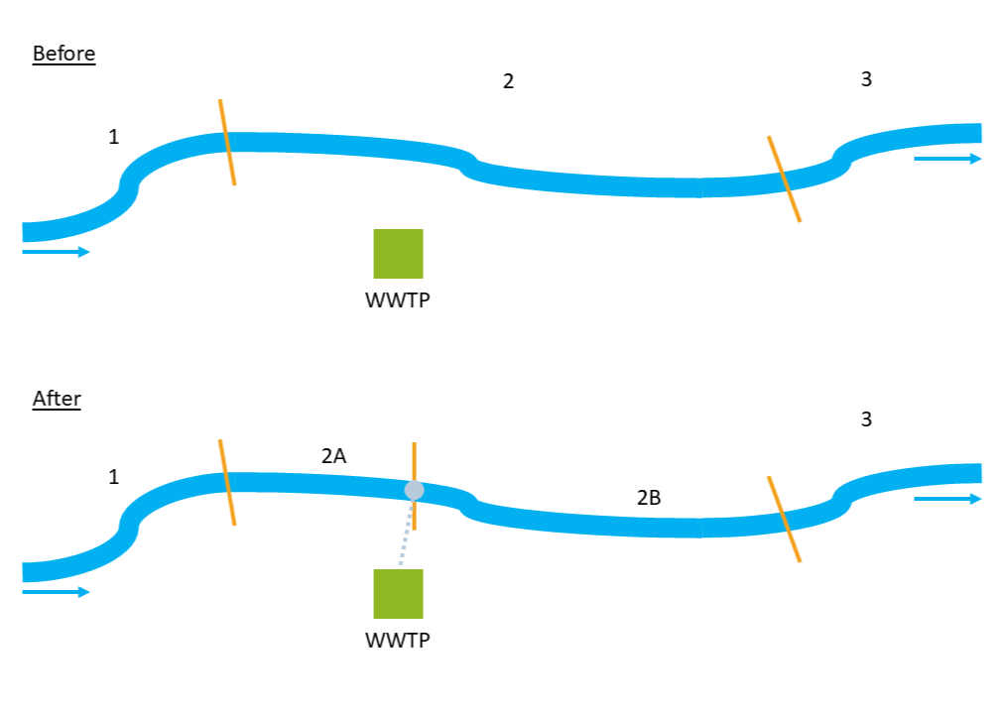

.. _accumulation:

Accumulation
------------
| This tool combine the output of :ref:`flow-estimation-tool` with the output of :ref:`emission-loads`. In this part, the load of the selected APIs is transferred to 
 the river network and the concentration for *mean flow* and *mean low flow* condition is calculated.
| In the first step, each emission point is projected onto the closest river section, where a new sub-section is created to integrate the WWTP discharge. 
 In the example shown in :numref:`accumulation_division-fig`, three river sections and one WWTP are considered. The emission point is connected to river section 2, which is then divided into 2A 
 and 2B. Because flow direction is from section 1 toward section 3, the load is transferred downstream to 2B and 3, while sections 1 and 2A remain unaffected by API inputs. 
 From section 2B onward then, the emitted load is accumulated along the river network. 
| After splitting, the mean flow and mean low flow of section 2 (the affected section) is proportionally redistributed between 2A and 2B (the new sub-sections) according to 
 their relative lengths.

.. _accumulation_division-fig:

    How the division in extra river sections at WWTPs works within the plugin.

Once all WWTP emission points have been processed this way, API loads are progressively accumulated downstream along the network. Based on these accumulated loads and the 
flow values stored in the river shapefile, API concentrations are then calculated for each river section with formula :math:numref:`accumulation_equation`. 
Two values are derived: concentration under mean flow conditions and concentration under mean low flow conditions.

.. math::
    :label: accumulation_equation

    PEC = \frac{\sum (m_{WW,eff})_{up}}{Q} \cdot k
    

With:

- :math:`PEC` = Predicted Environmental Concentration [:math:`ng/L`]
- :math:`(m_{WW,eff})_{up}` = load from all the upstream river section [:math:`kg/a`]
- :math:`Q` = mean flow or mean low flow [:math:`m^3\!/s`] 
- :math:`k` = conversion factor [:math:`\frac{ng/kg \cdot m^3\!/L}{s/a}`]

Input data
^^^^^^^^^^
Two input data are required for this tool:

* **emission_loads.shp**
* **river_level.shp**

The **emission_loads.shp** is the output of :ref:`emission-loads` while **river_level.shp** is the output of :ref:`flow-estimation-tool`. In case the user already has
regionalized flow data, going through the :ref:`Flow_Estimation` set of tools is not necessary. The important fields that should be in **river_level.shp** are:

- ID field: a column with a unique ID for each river section
- Next field: a column with the ID of the downstream river section 
- Mean flow: mean flow value for the single river section [:math:`m^3\!/s`]
- Accumulated mean flow: sum of the upstream mean flow values [:math:`m^3\!/s`]
- Mean low flow: mean low flow value for the single river section [:math:`m^3\!/s`]
- Accumulated mean low flow: sum of the upstream mean low flow values [:math:`m^3\!/s`]

Regarding **emission_loads.shp**, the emission point should be at maximum 500 m from the closest river section, as stated before. If not, edit the location of the point.

Workflow
^^^^^^^^

1. Add the input data to the project by clicking on "Layer -> Add Layer -> Add Vector Layer"
2. Go in the Processing Toolbox and look for the *APRIORA* plugin. Click on *API emission* and open *7 - Accumulation*
3. Choose **emission_loads.shp** as input for *API load*
4. Select the fields containing the APIs to accumulate. This selection should include only columns containing load of APIs in kg/a.
5. Choose **river_level.shp** as input for *River network*
6. | Select the correct field of **river_level.shp** for *ID Field*, *Next Field*, *Mean Flow*, *Acc. Mean Flow*, *Mean Low Flow* and *Acc. Mean Low Flow*. 
     In case **river_level.shp** is the output of :ref:`flow-estimation-tool`, here are the correct fields to select:
    
     - *ID Field* -> NET_ID
     - *Next Field* -> NET_TO
     - *Mean Flow* -> Mean_Flow
     - *Acc. Mean Flow* -> calc_Mean\_
     - *Mean Low Flow* -> M_Low_Flow
     - *Acc. Mean Low Flow* -> calc_M_Low
7. Click on *Run*

.. raw:: html

   <figure>
     <video width="700" height="370" controls>
       <source src="_static/video/accumulation_2.mp4" type="video/mp4">
       Your browser does not support the video tag.
     </video>
     <figcaption>Video: Worflow of the <i>Accumulation</i> tool.</figcaption>
   </figure>

Output data:

* **river_accumulation.shp**

The output is a line shapefile containing the updated geometry of the river network. Its attribute table contains, for each section, the emitted load, the
accumulated load and the resulting concentrations under both normal and low-flow condition for each API. :numref:`accumulation_table` shows only a part of the attribute table 
for one substance and a few river sections.

.. _accumulation_table:

.. list-table:: Example of attribute table of river_accumulation.shp.
    :header-rows: 1
    :widths: 15 15 15 15 15 15

    * - NET_ID
      - NET_TO
      - Carb[kg/a]
      - acc_Carb [#f1]_
      - conc_Carb [#f2]_
      - conL_Carb [#f3]_
    * - 1005
      - 1006
      - 0
      - 17.789
      - 39.422
      - 150.251
    * - 1006
      - 1007
      - 0
      - 17.789
      - 39.265
      - 149.398
    * - 1007
      - 1008A
      - 0
      - 17.789
      - 39.134
      - 148.712
    * - 1008A
      - 1008B
      - 0
      - 17.789
      - 38.615
      - 148.277
    * - 1008B
      - 1009
      - 3.68
      - 21.469
      - 41.873
      - 168.519
    * - 1009
      - 1010
      - 0
      - 21.469
      - 41.671
      - 167.611
    * - 1010
      - 1011
      - 0
      - 21.469
      - 41.368
      - 166.652
    * - 1011
      - 1012
      - 0
      - 21.469
      - 40.693
      - 164.549
    
.. [#f1] Accumulation of Carbamazepine [:math:`kg/a`]
.. [#f2] Concentration of Carbamazepine in normal conditions [:math:`ng/L`]
.. [#f3] Concentration of Carbamazepine in low flow conditions [:math:`ng/L`]
