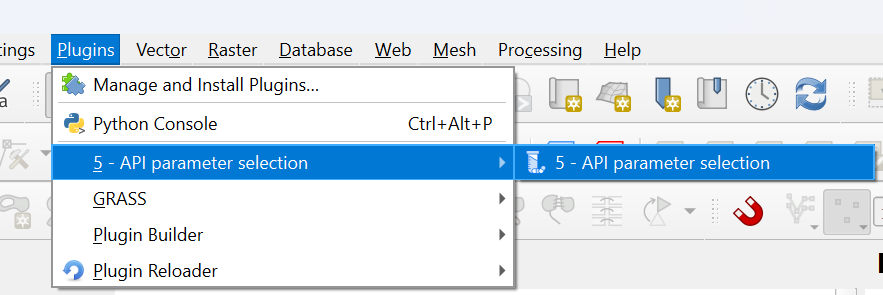

.. _API-parameter-selection:

API parameter selection
=======================
This tool is giving the user the access to the APRIORA's internal database related to consumption data, removal rates and PNEC values.
Since it is not a processing tool, the user cannot find it under the *Processing Toolbox*. It is displayed instead under *Plugins* --> *API parameter selection* 
(:numref:`API_parameter_selection_menu-fig`) or in the Menu Toolbar (:numref:`consumption_selection-fig`).

.. _API_parameter_selection_menu-fig:

  How to find *API parameter selection* tool under *Plugins*.

.. _consumption_selection-fig:

.. figure:: images/consumption_selection.png
  :width: 300

  Location of the *API parameter selection* tool in the Menu Toolbar.

    
The tool contains 4 different windows:

* :ref:`consumption_data`
* :ref:`removal_rate`
* :ref:`custom_table`
* :ref:`PNEC_values`

In the next paragraphs, the functionalities of each windows are described. More detailed instruction on how to use them can be found in the video-tutorial 
in the **Workflow** section below.

.. important::
  In the following screenshots and video-tutorials, the *API parameter selection* is called *Consumption Selection*. The name comes from the version 0.6.5 of the tool.
  In version 0.6.6, the tool was renamed to *API parameter selection*. Updated screenshots and video-tutorials will be uploaded soon.

.. _consumption_data:

Consumption data
----------------
| Here the user can explore the consumption data related to several substances, with different spatial and temporal coverage (:numref:`consumption_interface-fig`). The consumption data is expressed in 
 *mg/inh./a* and it is already including the excretion rate from the human body. When a regional coverage is not available, it is marked as "-" and the national
 value is considered instead. The consumption values are calculated with the formula :math:numref:`consumption_equation`.

.. math::
    :label: consumption_equation

    m_{i,y} = ((m_{cp,y} + m_{cs,y}) \cdot e)/n_{pop}
    

With:

- :math:`m_{i,y}` = yearly consumption of y API [:math:`mg/inh/a`]
- :math:`m_{cp,y}` = yearly prescribed API intake [:math:`kg/a`]
- :math:`m_{cs,y}` = yearly sold over-the-counter API intake [:math:`kg/a`]
- :math:`e` = API specific excretion rate [-]
- :math:`n_{pop}` = population in the reference area for intake data  [-]

| In case the user would like to add a new substance in the database or the same substance but with a different coverage, it is possible to
 do it by clicking on the "+" icon. A new row is added at the bottom of the table and the user should fill out the cells with important information like: API input, API name,
 year, country and region. The other fields can be kept empty. In case a wrongful substance is added, it is possible to select it and then remove it with the "-" icon. When 
 all the changes have been applied, click on the save icon. If the user would like to go back to the core table, simply click on "Restore original".

.. _consumption_interface-fig:

.. figure:: images/consumption_interface.png

  Interface of the "Consumption data" window within the API parameter selection tool. 

Input data
^^^^^^^^^^
For this tool no input data is required. All the necessary input data (consumption values) are already provided. In case the user would like to add their own input data,
it is possible to do so.

Workflow
^^^^^^^^

1. Click on the *5 - API parameter selection* icon in the menu toolbar or go under *Plugins* --> *5 - API parameter selection*
2. Go on the "Consumption data" window
3. Explore the database and find the APIs that you are interested in (e.g., Carbamazepine and Diclofenac for 2023, Germany, MV)
4. Select the substances by filling out correctly the "API name", "Year", "Country" and "Region" fields
5. Click on "Add to the selection" and the substance will be added in the "Selected consumption data" window
6. Repeat the steps 3 - 5 with all the interested APIs
7. Click on "Save selection" 

In case the user would like to add custom substances:

8. Click on the "+" icon
9. Go to the bottom of the table and fill out the "API input", "API name", "year", "country" and "region" fields. The other fields can be kept empty.
10. Click on the save icon
11. Add to the selection the newly added API by repeating the steps 3 - 5.
12. Click on "Save selection" 

.. raw:: html

   <figure>
     <video width="700" height="370" controls>
       <source src="_static/video/Consumption_selection_2.mp4" type="video/mp4">
       Your browser does not support the video tag.
     </video>
     <figcaption>Video: Worflow of <i>Consumption data</i> window within <i>API parameter selection</i> tool.</figcaption>
   </figure>

.. _removal_rate:

Removal rate
------------
| This window (:numref:`removal_interface-fig`) contains a table with the removal rates of different APIs for the 4 different types of treatment: TC1 (primary treatment), screening and sedimentation; TC2 
 (secondary treatment), aeration and bacterial digestion; TC3 (tertiary treatment), nutrient removal, filtration and chlorine/UV; TC4 (quaternary treatment), activated
 carbon and reverse osmosis. This table provides cumulative removal rates for each treatment stage. This means the value for a given stage (e.g., TC3) already includes 
 the combined removal efficiency of all previous stages (TC1 and TC2). Therefore the calculation is direct and not sequential.
| With a similar logic like before, the user can add a new substance (or edit the current value) by clicking on the "+" icon. After making a change, remember to click
 on the save icon.

.. _removal_interface-fig:

.. figure:: images/removal_interface.png

  Interface of the "Removal rate" window within the API parameter selection tool. 

Input data
^^^^^^^^^^
For this tool no input data is required. All the necessary input data (removal rates) are already provided. In case the user would like to add their own input data,
it is possible to do so.

Workflow
^^^^^^^^

1. Go on the "Removal rate" window
2. Check if the values for the different APIs and different technical classes are correct
3. In case you would like to change something, simply double click on a number and update the value
4. In case you would like to add a new substance, click on the "+" icon and fill out all the fields ("CAS No." can be kept empty)
5. After all the edits, click on the save icon

.. raw:: html

   <figure>
     <video width="700" height="370" controls>
       <source src="_static/video/removal_rate_2.mp4" type="video/mp4">
       Your browser does not support the video tag.
     </video>
     <figcaption>Video: Worflow of <i>Removal rate</i> window within <i>API parameter selection</i> tool.</figcaption>
   </figure>

.. _custom_table:

Custom table
------------
| In case the user would like to further customize the input data like consumption and removal rates at a more detailed level, here it is possible to do it (:numref:`custom_table_interface-fig`).
 By selecting the WWTPs shapefile and the correct fields for ID, name and technical class, it is possible to display the consumption values and removal rates for each WWTPs included in the 
 shapefile. By doing so, the user can edit a consumption values or a removal rate for that specific WWTP. After doing any edit, click on the *Save* button. 

.. _custom_table_interface-fig:

.. figure:: images/custom_table_interface.png

  Interface of the "Custom table" window within the API parameter selection tool.

Input data
^^^^^^^^^^
One input data is necessary for this tool:

* **WWTP.shp**

The **WWTP.shp** is a point shapefile containing the emission point of the WWTPs as geometry and important information of the facilities in the attribute table. The required
information are: ID and name of the WWTP; number of connected inhabitant; number representing the type of treatment (1=primary, 2=secondary, 3=tertiary, 4=quaternary). An
example of these information can be summarized by :numref:`WWTP-attribute-table`.

Workflow
^^^^^^^^

1. Go on the "Custom table" window
2. Select the WWTP shapefile and specify the field for ID, name and technical class. In case you cannot find the shapefile between the available ones, click on the reload button.
3. Click on "Load Table"
4. Check the consumption values and removal rates at each WWTPs. In case you would like to change something, double click on a number and update the value.
5. After all the edits, click on "Save"

.. raw:: html

   <figure>
     <video width="700" height="370" controls>
       <source src="_static/video/custom_table_2.mp4" type="video/mp4">
       Your browser does not support the video tag.
     </video>
     <figcaption>Video: Worflow of <i>Custom table</i> window within <i>API parameter selection</i> tool.</figcaption>
   </figure>

.. _PNEC_values:

PNEC values
-----------
| This window (:numref:`PNEC_interface-fig`) contains a table with the PNEC values of different APIs expressed in ng/L. With a similar logic like before, the user can add a new substance 
 (or edit the current value) by clicking on the "+" icon. After making a change, remember to click on the save icon.
 As mere information, limit of quantification (LOQ) of two different laboratories are included: Kristianstad University (Sweden) and SYKE (Finland).

.. _PNEC_interface-fig:

.. figure:: images/PNEC_interface.png
  :width: 600

  Interface of the "PNEC values" window within the API parameter selection tool.

Input data
^^^^^^^^^^
For this tool no input data is required. All the necessary input data (PNEC values) are already provided. In case the user would like to add their own input data,
it is possible to do so.

Workflow
^^^^^^^^

1. Go on the "PNEC values" window
2. Check if the values for the different APIs are correct
3. In case you would like to change something, simply double click on a number and update the value
4. In case you would like to add a new substance, click on the "+" icon and fill out the "PNEC" field ("LOQ" fields can be kept empty)
5. After all the edits, click on the save icon

.. raw:: html

   <figure>
     <video width="700" height="370" controls>
       <source src="_static/video/PNEC_2.mp4" type="video/mp4">
       Your browser does not support the video tag.
     </video>
     <figcaption>Video: Worflow of <i>PNEC values</i> window within <i>API parameter selection</i> tool.</figcaption>
   </figure>