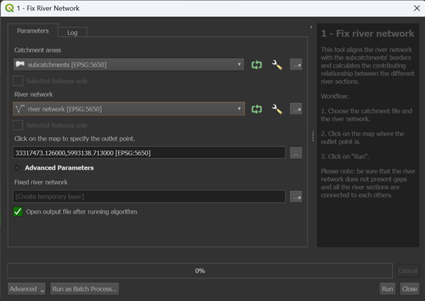

.. _Flow_Estimation:

Flow Estimation
===============

The *Flow Estimation* provides an estimation of yearly mean flow and yearly mean low fow for each subcatchment or 
river section within a specified catchment area. This estimation is made by **Random Forest** (insert link), which
uses the catchment's geographical characteristics as predictors and water flow data collected from gauging stations
to calibrate and validate the approach.

This group of tools is divided 4 different processes:

* Fix River Network
* Contributing Area
* Calculate Geofactors
* Flow Estimation

**insert plugin scheme**

Fix River Network
-----------------
Understanding the flow direction (where the water is going and which other river section it contributes to) is a critical aspect of the river network.
This information is very important for calculating the flow of each river section and determining accumulated values. 
Also, in many cases the intersection between the river network and the subcatchments is not perfectly aligned. This misalignment can cause issue in later 
steps of the plugin, so better fix the input beforehand! 

This algorithm was developed from the plugin *WaterNetAnalyzer* by Jannik Schilling (insert link).

NET_ID and NET_TO are very important because they explain the relationship of the river network.

It can happen that there is a misalignment between the river sections and the subcatchments. Here we fix it.
We fix it because otherwise the model struggle to understand where the water is flowing and it can cause errors or over/under estimation during the flow model.

**insert picture of river and subcatchments misalignment**

If the misalignment is greater than 10 cm, the plugin will not fix it and it is necessary to manually adjust the input file. Check the :ref:`Troubleshooting` section
for more information about it.

Input data
^^^^^^^^^^
Two input data are necessary for this tool:

* **subcatchments.shp**
* **river_network.shp**

The **subcatchments.shp** is a polygon shapefile that describes the division of the catchment in water basins.
The **river_network.shp** is a line shapefile that represents the river network within the catchment. It is important that all the sections are connected
to each others without gaps. It is also required a precise alignment between the river network and the subcatchments (like already explained above).
For this tool, their attributes are not important, more important is their geometry.

**figure with example of input data**

Workflow
^^^^^^^^

1. Add all the input data to the project by clicking on "Layer --> Add Layer --> Add Vector Layer"
2. Go in the Processing Toolbox and look for the *APRIORA* plugin. Click on *Flow estimation* and open *1 - Fix River Network*
3. Choose **subcatchments.shp** as input for *Catchment areas*
4. Choose **river_network.shp** as input for *River network*
5. Click on the three dots and click on the outlet point of the river network. The selected point does not have to be exactly on the outlet, just approximately there.
6. Click on *Run*

**insert video tutorial**

Output data:

* **fixed_river_network.shp**

Two new columns have been added to the attribute table: NET_ID and NET_TO. These columns represent respectively the river network ID of each specific section and the river network ID of
the downstream river section. Before we continue, it is important to check if the new colums are populated correctly for all river sections. If any value under NET_TO is marked as 
*unconnected*, it might be due to the fact that the river sections are not connected with each others. Check the geometry of the *unconnected* river sections, manually adjust them and re-run the
tool until there are no *unconnected* values in the NET_TO column. Important: apply the changes to the original file **river_network.shp** and not to **fixed_river_network.shp**. 

Contributing Area of Gauging Station
------------------------------------
Every gauging station measures the flow of a river. However, to understand the flow dynamics, we need to determine the area contributing to each gauging station.
This tool allows us to calculate the area upstream each gauging station, which we will use in a later step of the plugin. In case we have more than one gauging 
station within the catchment, the tool will generate a single output file where the contributing areas overlap.

Input data
^^^^^^^^^^

* **subcatchments.shp**
* **fixed_river_network.shp** (from *Fix River Network*)
* **gauging_stations.shp**

The first two input data were already discussed previously, so let's talk about the **gauging_stations.shp**. It is a point shapefile representing the 
gauging stations within the catchment. Beside the basic information (like ID, coordinates, etc.), it should contain two columns related to *Mean Flow*
and *Mean Low Flow* calculated at the gauging station. The two average values should be calculated over a certain time series (e.g., 1991 - 2020).
In Table 1, you can see an example of the **gauging_stations.shp**.

.. list-table:: Gauging stations example.
    :header-rows: 1
    :widths: 25 30 20 20

    * - gml_id
      - Name
      - Mean Flow
      - Mean Low Flow
    * - ID_1974292
      - Rostock-Geinitzbrücke
      - 18,13
      - 4,39
    * - ID_1974292
      - Rostock-Geinitzbrücke
      - 18,13
      - 4,39
    * - ID_1974292
      - Rostock-Geinitzbrücke
      - 18,13
      - 4,39
    * - ID_1974292
      - Rostock-Geinitzbrücke
      - 18,13
      - 4,39
    * - ID_1974292
      - Rostock-Geinitzbrücke
      - 18,13
      - 4,39

Workflow
^^^^^^^^

1. Add all the input data to the project by clicking on "Layer --> Add Layer --> Add Vector Layer"
2. Go in the Processing Toolbox and look for the *APRIORA* plugin. Click on *Flow estimation* and open *2 - Contributing Area of Gauging Station*
3. Choose **subcatchments.shp** as input for *Catchment areas*
4. Choose **fixed_river_network.shp** as input for *River network*
5. Choose **gauging_stations.shp** as input for *Gauging stations*
6. Select the *Mean Flow* field and *Mean Low Flow* field from **gauging_stations.shp**
7. Click on *Run*

**insert video tutorial**

Output data:

* **gauged_subcatchments.shp**
* **ungauged_subcatchments.shp**

Open the attribute table of **gauged_subcatchments.shp** and check its features. Each feature represents the contributing area for a gauging station. If
there is more than one gauging station, you will notice that the contributing areas are overlapping. If you want to highlight a specific feature, right-click
on it and select *Flash Feature*. Important to notice: there are two extra fields called *Mean_Flow* and *M_L_Flow* that come directly from **gauging_stations.shp**.

Now, open the attribute table of **ungauged_subcatchments.shp**. You will find a new column called *id_catch*. This field assigns a unique code to each subcatchment
and river section, making it easier to link subcatchments with their corresponding river section in later steps.

Calculate Geofactors
--------------------
The flow estimation model uses a machine learning approach to estimate the water flow. The main core of this ML-based regionalization is to establish a predictive
relationship between model parameters and subcatchment geofactors. This relationship is used to predict the morel parameters of ungauged subcatchments and estimate
their water flow. The geofactors are physical and hydrological chatacteristics of subcatchments, such as area, slope or land use, that influence water flow.
In this tool we use certain input data to calculate the geofactors related to each subcatchment.

Input data
^^^^^^^^^^
* **gauged_subcatchments.shp** (from *Contributing Area of Gauging Station*)
* **ungauged_subcatchments.shp** (from *Contributing Area of Gauging Station*)
* **fixed_river_network.shp** (from *Fix River Network*)
* **DEM.tif**
* **water_area.shp**
* **forest_area.shp**
* **settlement_area.shp**
* **precipitation data**

The first three input data were already discussed previously. **DEM.tif**, is a digital elevation model raster file. **water_area.shp**, **forest_area.shp**
and **settlement_area.shp** are polygon shapefile representing respectively water bodies (lakes), forest and settlement area. Last is **precipitation data**
that can be stored as several .nc files in a folder or as a unique raster file. The **precipitation data** should cover a time series equal to the time series
selected for the flow at the gauging stations.

**insert a table of where we can find the data**

Workflow
^^^^^^^^

Flow Estimation
---------------
This is the last part of the model where we estimate the flow.

Random Forest Regressor
^^^^^^^^^^^^^^^^^^^^^^^
This is the model used for estimating the flow.