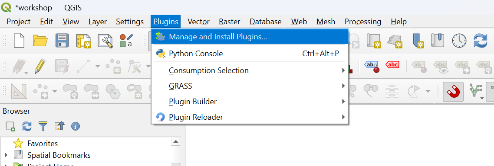

.. _Installation:

Installation for Windows
========================

Extra library required
----------------------
| To run the :ref:`Flow_Estimation` tool, an extra library called **scikit-learn** (`source <https://scikit-learn.org/stable/>`_) is necessary and 
 is not included in the standard QGIS installation. In case you already have regionalized flow data, you can skip this step. To install the missing package:

1. Open "OSGeo4W Shell", you can find it already installed with QGIS.
2. Digit::

      python -m pip install scikit-learn

3. Press *Enter*

| If you encounter errors, check the :ref:`Troubleshooting` section.

Installation via local repository
---------------------------------
Since the tool is not published yet in the official QGIS repository, it is necessary to add a local repository to have access to its download.
It is possible to do so by following these steps:

1. Open QGIS and go to *Plugins* --> *Manage and Install Plugins* (:numref:`installation-location-fig`)

.. _installation-location-fig:

      
      Location of Manage and Install Plugins.

2. Go to *Settings* and click on *Add...*
3. Under *Name* digit "APRIORA repository" (or whatever you prefer)
4. Under *URL* insert ``https://cridrive66.github.io/APRIORA-rep/plugin.xml`` (:numref:`repository_1-fig`)
5. Click on *OK*

.. _repository_1-fig:

.. figure:: images/Repository_1.png
      :width: 500
      
      How to fill the Repository details.

6. Check if the *Status* of the repository is **connected** (:numref:`repository_2-fig`)

.. _repository_2-fig:

.. figure:: images/Repository_2.png

      Status of the repository.

7. Go to *All* and digit "APRIORA" in the search bar.
8. Click on *Install Plugin*

In case you still have problems with the installation, check the video-tutorial below.

.. raw:: html

   <figure>
     <video width="700" height="370" controls>
       <source src="_static/video/installation_nv.mp4" type="video/mp4">
       Your browser does not support the video tag.
     </video>
     <figcaption>Video: How to install the APRIORA plugin.</figcaption>
   </figure>

Installation via .zip file
--------------------------
The plugin can also be installed by downloading the .zip file from the Github repository (insert link).
In order to do this:

1. Download the .zip file from Github
2. Open QGIS and go to *Plugins* --> *Manage and Install Plugins*
3. Go to *Install from ZIP file* and select the .zip folder previously downloaded
4. Click on *Install Plugin*