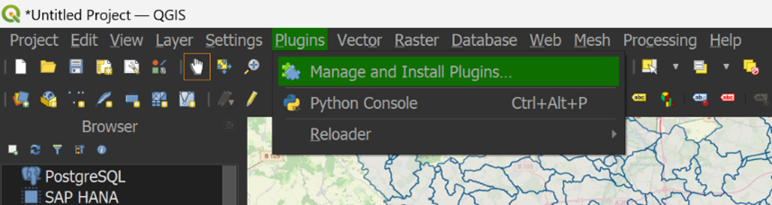
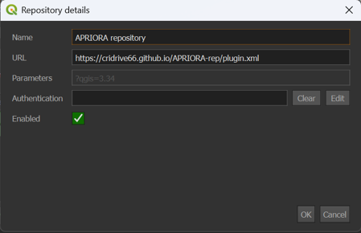

.. _Installation:

Installation for Windows
========================

Extra library required
----------------------
.. note::
      An extra library is required

To run the plugin, you will need to download an extra library called "scikit-learn" (insert link) which is not included in the standard QGIS installation.
To install the missing package, follow these steps:

1. Open "OSGeo4W Shell", you can find it already installed with QGIS.
2. Digit::

      python -m pip install scikit-learn

3. Press *Enter*

If you encounter errors, check the :ref:`Troubleshooting` section.

Add a local repository to QGIS
------------------------------

After succesfully installed "scikit-learn", you can open QGIS and go to *Plugins* --> *Manage and Install Plugins*.

1. Go to *Settings* and click on *Add...*
2. Under *Name* digit "APRIORA repository" (or whatever you prefer)
3. Under *URL* insert ``https://cridrive66.github.io/APRIORA-rep/plugin.xml``
4. Click on *OK*

5. Check if the *Status* of the repository is **connected**

.. image:: images/Repository_2.png