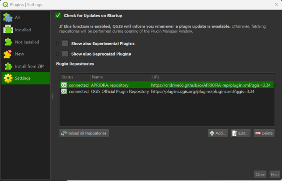

.. _Installation:

Installation for Windows
========================

Extra library required
----------------------
.. note::
      To run the plugin, you will need to download an extra library called **scikit-learn** (`source <https://scikit-learn.org/stable/>`_) which is not included in the standard QGIS installation.

To install the missing package, follow these steps:

1. Open "OSGeo4W Shell", you can find it already installed with QGIS.
2. Digit::

      python -m pip install scikit-learn

3. Press *Enter*

If you encounter errors, check the :ref:`Troubleshooting` section.

Installation via local repository
---------------------------------
After succesfully installed "scikit-learn", you can open QGIS and go to *Plugins* --> *Manage and Install Plugins*.

1. Go to *Settings* and click on *Add...*
2. Under *Name* digit "APRIORA repository" (or whatever you prefer)
3. Under *URL* insert ``https://cridrive66.github.io/APRIORA-rep/plugin.xml``
4. Click on *OK*

.. image:: images/Repository_1.png

5. Check if the *Status* of the repository is **connected**

Installation via .zip file
--------------------------
The plugin can also be installed by downloading the .zip file from the Github repository (insert link).
In order to do this:

1. Download the .zip file from Github
2. Open QGIS and go to *Plugins* --> *Manage and Install Plugins*
3. Go to *Install from ZIP file* and select the .zip folder previously downloaded
4. Click on *Install Plugin*