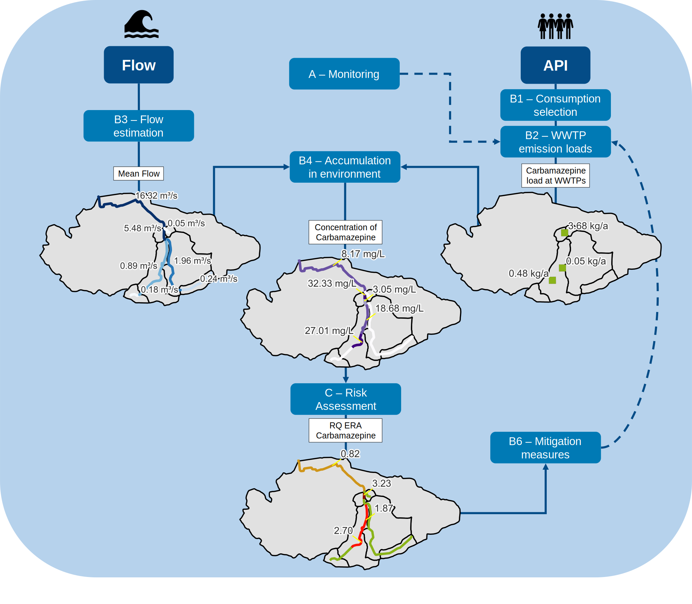

.. _Introduction:

Introduction
============
The *APRIORA* plugin is a QGIS tool divided in two groups:

* :ref:`Flow_Estimation`
* :ref:`API_Emission`

The first group of tools is designed to estimate flow in normal and low condition in a catchment, while the
second one calculate concentration of different Active Pharmaceutical Ingredients (APIs) and perform the 
risk assessment in each river section.

For more information, check the `project website <https://interreg-baltic.eu/project/apriora/>`_.

Getting Started
---------------
Please find instructions on how to install the plugin in the :ref:`Installation` section.

Support, contributing and testing
---------------------------------
Please contribute using **Github (insert link)**. Create a branch, add commits and *open a pull request*.

Reporting bugs
^^^^^^^^^^^^^^
If you find a bug in APRIORA plugin, please open a new issue (insert link) and tag it "bug".

Suggesting improvements
^^^^^^^^^^^^^^^^^^^^^^^
If you want to suggest a new feature or an improvement of a current feature, you can submit this on the issue tracker (insert link) and tag it "improvement".

Latest changhes
---------------
This section contains the most recent changes and updates to the plugin.

* v.0.6.2: Fixed typo in *Consumption Selection* tool.
* v.0.6.1: Fixed connection between PNEC custom table and *Risk assessment* tool.
* v.0.6: *Risk assessment* tool added to the set of available tools.
* v.0.5.1: Added feature to customize input data of *Consumption selection*.
* v.0.5: *Accumulation* tool developed.
* v.0.4: *API Emission* set of tools is created. *Consumption selection* and *Emission Loads* developed.
* v.0.3: Adaptation for transferability of *Contributing area of gauging station*, *Calculate geofactors*, *Flow estimation* to the new algorithm developed in v.0.3
* v.0.2: *Fix River Network* is developed for transferability of *Flow estimation* in different catchments.
* v.0.1: *Flow estimation* set of tools developed (*Contributing area of gauging station*, *Calculate geofactors*, *Flow estimation*), but working only for the German case study (Warnow).