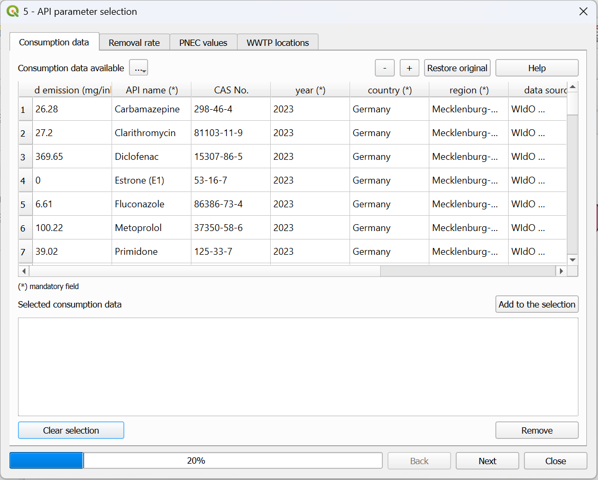
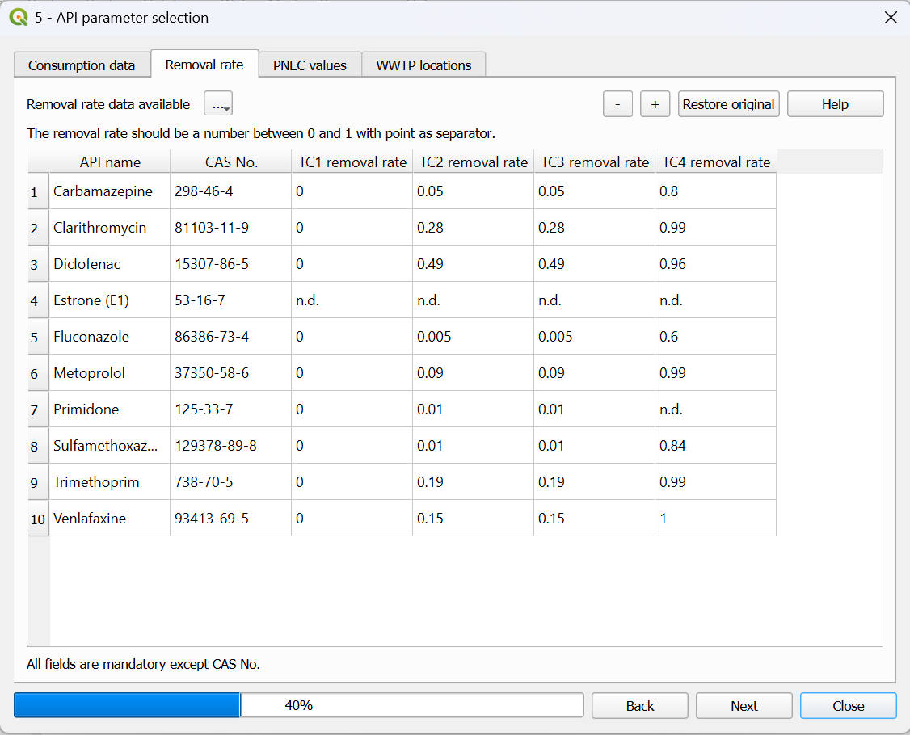
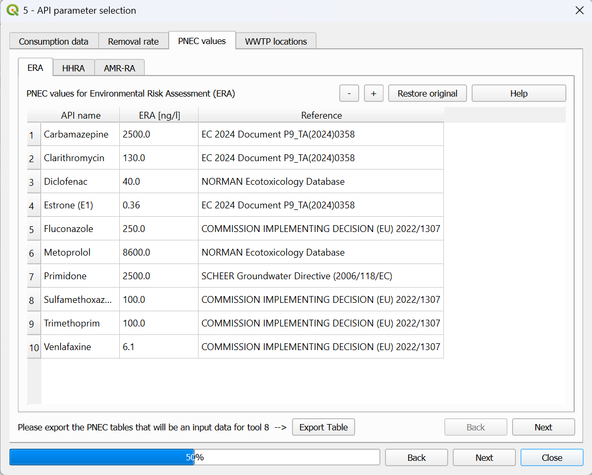
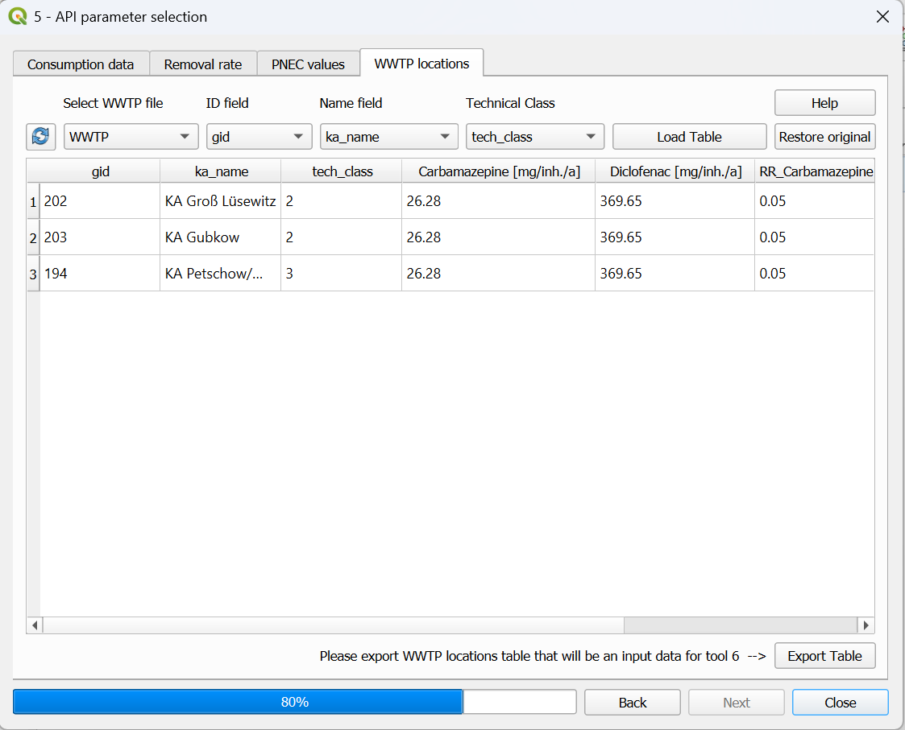

.. _API-parameter-selection:

API parameter selection
=======================
This tool is giving the user the access to the APRIORA's internal database related to consumption data, removal rates and PNEC values.
    
The tool contains 4 different windows:

* :ref:`consumption_data`
* :ref:`removal_rate`
* :ref:`wwtp_locations`
* :ref:`PNEC_values`

In the next paragraphs, the functionalities of each windows are described. More detailed instruction on how to use them can be found in the video-tutorial 
in the **Workflow** section below.

.. _consumption_data:

Consumption data
----------------
| Here the user can explore the consumption data related to several substances, with different spatial and temporal coverage (:numref:`consumption_interface-fig`). The consumption 
 data is expressed in *mg/inh./a* and it is already including the excretion rate from the human body. When a regional coverage is not available, it is marked as "-" 
 and the national value is considered instead. The consumption values are calculated with the formula :math:numref:`consumption_equation`.

.. math::
    :label: consumption_equation

    m_{i,y} = ((m_{cp,y} + m_{cs,y}) \cdot e)/n_{pop}
    

With:

- :math:`m_{i,y}` = yearly consumption of y API [:math:`mg/inh/a`]
- :math:`m_{cp,y}` = yearly prescribed API intake [:math:`kg/a`]
- :math:`m_{cs,y}` = yearly sold over-the-counter API intake [:math:`kg/a`]
- :math:`e` = API specific excretion rate [-]
- :math:`n_{pop}` = population in the reference area for intake data  [-]

| In case the user would like to add a new substance in the database or the same substance but with a different coverage, it is possible to
 do it by clicking on the "+" icon. A new row is added at the bottom of the table and the user should fill out the cells with important information like: API input, API name,
 year, country and region. The other fields can be kept empty. In case a wrongful substance is added, it is possible to select it and then remove it with the "-" icon. 
 If the user would like to go back to the core table, simply click on "Restore original".

.. _consumption_interface-fig:

  Interface of the "Consumption data" window within the API parameter selection tool. 

Input data
^^^^^^^^^^
For this tool no input data is required. All the necessary input data (consumption values) are already provided. In case the user would like to add their own input data,
it is possible to do so.

Workflow
^^^^^^^^

1. Click on the *5 - API parameter selection* icon in the menu toolbar or go under *Plugins* --> *5 - API parameter selection*
2. Go on the "Consumption data" window
3. Explore the database and find the APIs that you are interested in (e.g., Carbamazepine and Diclofenac for 2023, Germany, MV)
4. Select the substances, click on "Add to the selection" and the substance will be added in the "Selected consumption data" window
5. Repeat the steps 3&4 with all the interested APIs

In case the user would like to add custom substances:

6. Click on the "+" icon
7. Go to the bottom of the table and fill out the "API input", "API name", "year", "country" and "region" fields. The other fields can be kept empty.
8. Add to the selection the newly added API by repeating the steps 3&4.

In case the user would like to export the consumption table with other users:

9. Click on the three dots in the top left corner and select "Export table (for sharing only)"

In case the user would like to import the consumption table from other users:

10. Click on the three dots in the top left corner and select "Import external consumption table"

.. important::
    Video tutorial will follow soon.

.. _removal_rate:

Removal rate
------------
| This window (:numref:`removal_interface-fig`) contains a table with the removal rates of different APIs for the 4 different types of treatment: TC1 (primary treatment), screening 
 and sedimentation; TC2 (secondary treatment), aeration and bacterial digestion; TC3 (tertiary treatment), nutrient removal, filtration and chlorine/UV; TC4 (quaternary treatment), 
 activated carbon and reverse osmosis. This table provides cumulative removal rates for each treatment stage. This means the value for a given stage (e.g., TC3) already includes 
 the combined removal efficiency of all previous stages (TC1 and TC2). Therefore the calculation is direct and not sequential.
| With a similar logic like before, the user can add a new substance (or edit the current value) by clicking on the "+" icon.

.. _removal_interface-fig:

  Interface of the "Removal rate" window within the API parameter selection tool. 

Input data
^^^^^^^^^^
For this tool no input data is required. All the necessary input data (removal rates) are already provided. In case the user would like to add their own input data,
it is possible to do so.

Workflow
^^^^^^^^

1. Go on the "Removal rate" window
2. Check if the values for the different APIs and different technical classes are correct
3. In case you would like to change something, simply double click on a number and update the value
4. In case you would like to add a new substance, click on the "+" icon and fill out all the fields ("CAS No." can be kept empty)

In case the user would like to export the removal rate table with other users:

5. Click on the three dots in the top left corner and select "Export table (for sharing only)"

In case the user would like to import the removal rate table from other users:

6. Click on the three dots in the top left corner and select "Import external removal rate table"

.. important::
    Video tutorial will follow soon.

.. _PNEC_values:

PNEC values
-----------
| This window (:numref:`PNEC_interface-fig`) contains information about three different type of risk assessment:

- Environmental Risk Assessment (ERA)
- Human Health Risk Assessment (HHRA)
- Antimicrobial Resistance Risk Assessment (AMR-RA)

All the PNEC values are expressed in ng/L. With a similar logic like before, the user can add a new substance 
(or edit the current value) by clicking on the "+" icon. 

.. _PNEC_interface-fig:

  Interface of the "PNEC values" window within the API parameter selection tool.

Input data
^^^^^^^^^^
For this tool no input data is required. All the necessary input data (PNEC values) are already provided. In case the user would like to add their own input data,
it is possible to do so.

Workflow
^^^^^^^^

1. Go on the "PNEC values" window
2. Check if the values for the different APIs are correct
3. In case you would like to change something, simply double click on a number and update the value
4. In case you would like to add a new substance, click on the "+" icon and fill out the corresponding row
5. After all the edits, click on "Export Table". The table will be saved and added to the project. It will be used as an input for :ref:`risk-assessment`.

.. important::
    Video tutorial will follow soon.

.. _wwtp_locations:

WWTP locations
--------------
| In case the user would like to further customize the input data like consumption and removal rates at a more detailed level, here it is possible to do it (:numref:`WWTP_emission_interface-fig`).
 By selecting the WWTPs shapefile and the correct fields for ID, name and technical class, it is possible to display the consumption values and removal rates for each WWTPs included in the 
 shapefile. By doing so, the user can edit a consumption values or a removal rate for that specific WWTP.

.. _WWTP_emission_interface-fig:

  Interface of the "WWTP locations" window within the API parameter selection tool.

Input data
^^^^^^^^^^
One input data is necessary for this tool:

* **WWTP.shp**

The **WWTP.shp** is a point shapefile containing the emission point of the WWTPs as geometry and important information of the facilities in the attribute table. The required
information are: ID and name of the WWTP; number of connected inhabitant; number representing the type of treatment (1=primary, 2=secondary, 3=tertiary, 4=quaternary). An
example of these information can be summarized by :numref:`WWTP-attribute-table`.

Workflow
^^^^^^^^

1. Go on the "WWTP locations" window
2. Select the WWTP shapefile and specify the field for ID, name and technical class. In case you cannot find the shapefile between the available ones, click on the reload button.
3. Click on "Load Table"
4. Check the consumption values and removal rates at each WWTPs. In case you would like to change something, double click on a number and update the value.
5. After all the edits, click on "Export Table". The table will be saved and added to the project. It will be used as an input for :ref:`emission-loads`.

.. important::
    Video tutorial will follow soon.