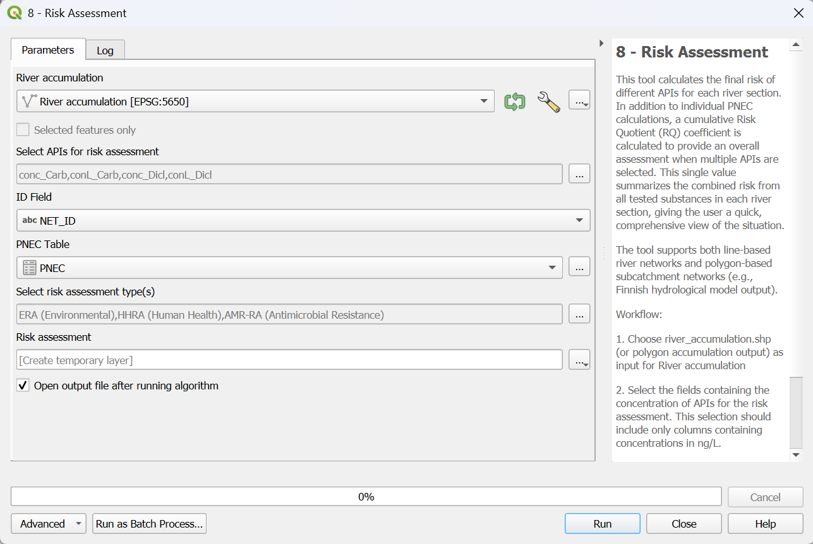

.. _risk-assessment:

Risk Assessment
===============
This tool calculates the final risk for each river section. Three different type of risk are considered:

- Environmental Risk Assessment (ERA)
- Human Health Risk Assessment (HHRA)
- Antimicrobial Resistance Risk Assessment (AMR-RA)

In addition to individual PNEC calculations, a Component Cumulative Risk Index (CCRI) is calculated to provide an overall assessment when
multiple APIs are selected. This single value summarizes the combined risk from all tested substances in each river section, giving the 
user a quick, comprehensive view of the situation. The CCRI is calculated using formula :math:numref:`ccri-formula`.

.. math::
    :label: ccri-formula

    CCRI = \log(RQ_{sum} + 1) \cdot \left( 1 + \frac{(RQ > 1)_{sum}}{RQ_{sum}} \right)
    

With:

- :math:`CCRI` = Component Cumulative Risk Index [-] 
- :math:`RQ_{sum}` = sum of RQs tested for *n* substances [-]
- :math:`(RQ > 1)_{sum}` = sum of RQs tested for *n* substances that are greater than 1 [-]

.. _ERA:

Environmental Risk Assessment (ERA)
-----------------------------------
ERA evaluates ecological impact by calculating the Risk Quotient (RQ) according to formula :math:numref:`ERA_equation`.

.. math::
    :label: ERA_equation

    RQ_{ERA} = \frac{PEC}{PNEC_{ERA}}
    

With:

- :math:`RQ_{ERA}` = Risk Quotient of Environmental Risk Assessment [-] 
- :math:`PEC` = Predicted Environmental Concentration [:math:`ng/L`]
- :math:`PNEC_{ERA}` = Predicted No Effect Concentration for ERA [:math:`ng/L`]

An RQ value greater than 1 indicates a potential risk, requiring deeper look into wheter a regulatory concern truly exists. Since PNEC values are often
estimates based on limited species data and assessment factors, they can be supplemented with QSAR (Quantitative Structure-Activity Relationship) screeneing
tools or NORMAN database values when experimental data is missing. Ultimately, the process prioritizes substances that are persistent or bioaccumulative,
as these compounds can disrupt ecosystems even at very low levels.

.. _HHRA:

Human Health Risk Assessment (HHRA)
-----------------------------------
The Human Health Risk Assessment (HHRA) evaluates the potential risks of lifelong exposure to APIs through accidental ingestion of surface water and the 
consumption of locally caught fish. This assessment relies on the RQ, which compares total human intake from these pathways to an Oral Reference Dose (RfD), 
the level considered safe for human consumption. To calculate intake, the model incorporates country-specific fish consumption rates, gastrointestinal 
absorption fractions, and Bioconcentration Factors (BCF) often derived from QSAR models. While the resulting RQ values are typically low, indicating a 
significant safety margin, the methodology can be used to determine "safe" surface water concentrations by back-calculating the concentration at which 
the RQ would equal one. The calculation expressed in formula :math:numref:`HHRA_equation` is then very similar to what shown in 
formula :math:numref:`ERA_equation`.

.. math::
    :label: HHRA_equation

    RQ_{HHRA} = \frac{PEC}{PNEC_{HHRA}}
    

With:

- :math:`RQ_{HHRA}` = Risk Quotient of Human Health Risk Assessment [-] 
- :math:`PEC` = Predicted Environmental Concentration [:math:`ng/L`]
- :math:`PNEC_{HHRA}` = Predicted No Effect Concentration for HHRA [:math:`ng/L`]

.. _AMR-RA:

Antimicrobial Resistance Risk Assessment (AMR-RA)
-------------------------------------------------
The Antimicrobial Resistance Risk Assessment (AMR-RA) evaluates the potential for antibiotic residues to select for resistant microbial populations using
a RQ. This calculation is very similar to what explained in :ref:`ERA`: a PNEC value is compared with PEC values and a value exceeding 1 indicates risk 
(formula :math:numref:`AMR-RA_equation`).

.. math::
    :label: AMR-RA_equation

    RQ_{AMR-RA} = \frac{PEC}{PNEC_{AMR-RA}}
    

With:

- :math:`RQ_{AMR-RA}` = Risk Quotient of Antimicrobial Resistance Risk Assessment [-] 
- :math:`PEC` = Predicted Environmental Concentration [:math:`ng/L`]
- :math:`PNEC_{AMR-RA}` = Predicted No Effect Concentration for AMR-RA [:math:`ng/L`]

Input data
----------
The following input files are necessary:

* **river_accumulation.shp** (from :ref:`accumulation`)
* **PNEC.csv** (from :ref:`PNEC_values`)

The key columns for this process are the ones containing concentration values. For each river section, formula :math:numref:`ERA_equation`,
:math:numref:`HHRA_equation` or :math:numref:`AMR-RA_equation` is applied and a PNEC value is calculated. 

Workflow
--------

1. If not already in the project, add the input data by clicking on "Layer -> Add Layer -> Add Vector Layer"
2. Go in the Processing Toolbox and look for the *APRIORA* plugin. Click on *API emission* and open *8 - Risk Assessment*
3. Choose **river_accumulation.shp** as input for *River network*
4. Select the fields containing the concentration of APIs for the risk assessment. This selection should include only columns containing concentrations in ng/L.
5. Select **PNEC.csv** as input for *PNEC Table*
6. Select which type of risk you would like to calculate (multiple selection is possible)
7. Click on *Run*

.. important::
    Video tutorial will follow soon.

  Interface of the "Risk Assessment" window.

Output data:

* **risk_assessment.shp**

| The output is a line shapefile containing the same geometry of **river_accumulation.shp**. The attribute table instead, has the same API concentration columns 
 plus RQ fields of the selected risk(s) for both conditions (mean flow and mean low flow) for each API selected. Finally, the last two columns represent CCRI for
 the selected risk(s) for the same two conditions.
| :numref:`risk_assessment_table` shows an example of a part of the attribute table where PEC of Carbamazepine and Diclofenac was calculated.

.. _risk_assessment_table:

.. list-table:: Example of attribute table of risk_assessment.shp (PNEC of Carbamazepine = 2500 ng/L).
    :header-rows: 1
    :widths: 15 15 15 15 15 15

    * - conc_Carb [#f1]_
      - conL_Carb [#f2]_
      - era_Carb [#f3]_
      - eraL_Carb [#f4]_
      - CCRI_era [#f5]_
      - CCRI_era_L [#f6]_
    * - 18.12
      - 109.95
      - 0.0072
      - 0.0439
      - 2.972
      - 6.157
    * - 4.677
      - 28.379
      - 0.0018
      - 0.0113
      - 0.633
      - 3.698
    * - 4.634
      - 28.119
      - 0.0018
      - 0.0112
      - 0.6295
      - 3.6834
    * - 3.0412
      - 18.453
      - 0.0012
      - 0.0073
      - 0.4544
      - 3.0009
    * - 2.8870
      - 17.517
      - 0.0011
      - 0.0044
      - 0.4357
      - 2.9206
    
.. [#f1] Concentration of Carbamazepine in normal conditions [:math:`ng/L`]
.. [#f2] Concentration of Carbamazepine in low flow conditions [:math:`ng/L`]    
.. [#f3] Environmental Risk Assessment of Carbamazepine in normal conditions [-]
.. [#f4] Environmental Risk Assessment of Carbamazepine in low flow conditions [-]
.. [#f5] CCRI for ERA in normal conditions [-]
.. [#f6] CCRI for ERA in low flow conditions [-]

The style of **risk_assessment.shp** is based on the value of CCRI and it is possible to change it by going on "Layer Properties" -> "Symbology".
