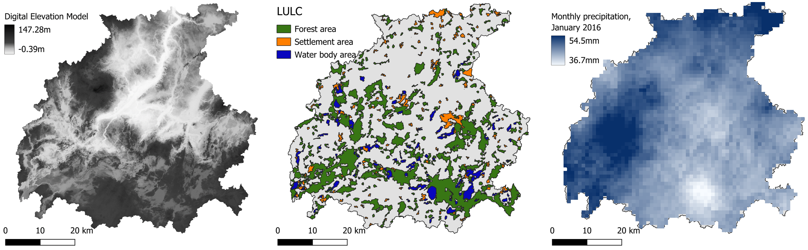
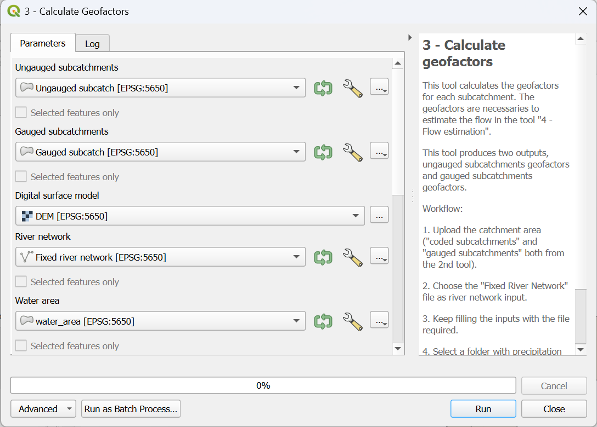
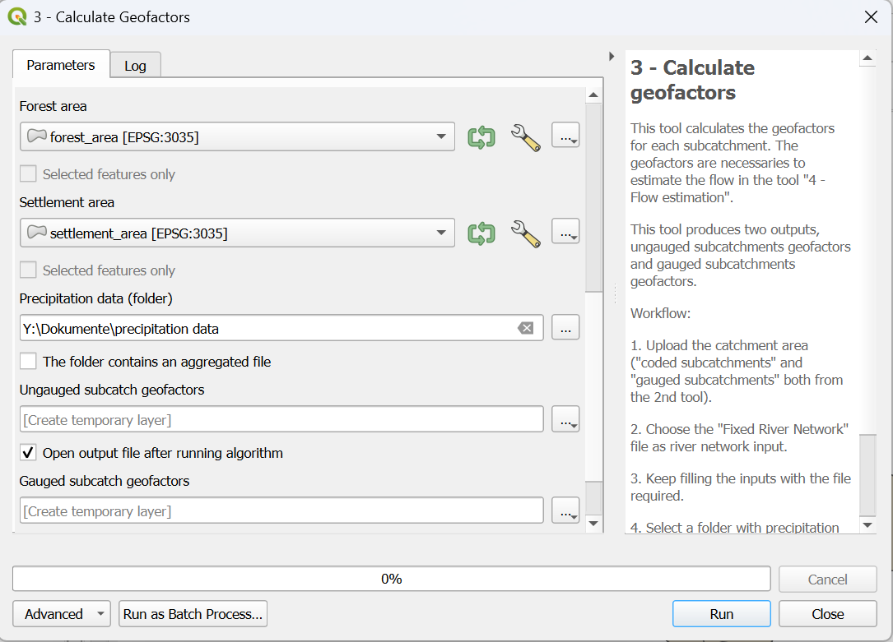

.. _Calculate_Geofactors:

Calculate Geofactors
====================

The flow estimation model uses a machine-learning (ML) approach to predict water flow in each subcatchment. At the core of this method is a regionalization
process that builds a predictive relationship between model parameters and the physical and hydrological characteristics -referred as *geofactors*- of the
subcatchments. These geofactors include properties such as area, slope, land use and other attributes known to influence hydrological behavior.

Once this relationship is established, it can be applied to ungauged subcatchments, allowing the model to estimate their parameters and simulate water flow
even in the absence of direct measurements. The tool automatically derives the necessary geofactors from the provided input datasets, guaranteeing consistent
and data-driven parameter prediction across all subcatchments.

Input data
----------
* **gauged_subcatchments.shp** (from :ref:`Contributing_Area`)
* **ungauged_subcatchments.shp** (from :ref:`Contributing_Area`)
* **fixed_river_network.shp** (from :ref:`Fix_River`)
* **DEM.tif**
* **water_area.shp**
* **forest_area.shp**
* **settlement_area.shp**
* **precipitation data**

The first three input data were already discussed previously. **DEM.tif**, is a digital elevation model raster file. **water_area.shp**, **forest_area.shp**
and **settlement_area.shp** are polygon shapefile representing respectively water bodies, forest and settlement area. Last is **precipitation data**
that can be stored as several .nc files in a folder or as a unique raster file. The **precipitation data** should cover a time series equal to the time series
selected for the flow at the gauging stations. An example representing these input data related to the Warnow catchment (Germany) can be found in 
:numref:`geofactors_example-fig`.

.. _geofactors_example-fig:

    
    From left to right: DEM, LULC and precipitation data for the Warnow catchment (Germany).

In :numref:`input_data_example` it is shown an example of possible sources where the necessary data can be found. For the ERA5 precipitation dataset,
"Monthly averaged reanalysis" should be selected as *Product type* and "Total precipitation" as *Variable*.

.. _input_data_example:

.. list-table:: Example of input data sources
   :header-rows: 1
   :widths: 3 3 4

   * - Input data
     - Format
     - Source
   * - DEM
     - Raster (.tif)
     - `Copernicus GLO-30 <https://portal.opentopography.org/raster?opentopoID=OTSDEM.032021.4326.3>`_
   * - Water area
     - Shapefile (.shp)
     - `CORINE Land Cover 2018 <https://land.copernicus.eu/en/products/corine-land-cover/clc2018#download>`_
   * - Forest area
     - Shapefile (.shp)
     - `CORINE Land Cover 2018 <https://land.copernicus.eu/en/products/corine-land-cover/clc2018#download>`_
   * - Settlement area
     - Shapefile (.shp)
     - `CORINE Land Cover 2018 <https://land.copernicus.eu/en/products/corine-land-cover/clc2018#download>`_
   * - Precipitation data
     - NetCDF (.nc)
     - `ERA 5 Total precipitation <https://cds.climate.copernicus.eu/datasets/reanalysis-era5-single-levels-monthly-means?tab=download>`_

Workflow
--------

1. Add all the input data to the project by clicking on "Layer --> Add Layer --> Add Vector Layer"
2. Go in the Processing Toolbox and look for the *APRIORA* plugin. Click on *Flow estimation* and open *3 - Calculate Geofactors*
3. Choose **ungauged_subcatchments.shp** as input for *Ungauged subcatchments*
4. Choose **gauged_subcatchments.shp** as input for *Gauged subcatchments*
5. Choose **DEM.tif** as input for *Digital surface model*
6. Choose **fixed_river_network.shp** as input for *River network*
7. Choose **water_area.shp** as input for *Water area*
8. Choose **forest_area.shp** as input for *Forest area*
9. Choose **settlement_area.shp** as input for *Settlement area*
10. Select the **precipitation data** folder containing the time serie of raster file or the aggregated file and tick the box accordingly
11. Click on *Run*

.. important::
    Video tutorial will be uploaded soon.

    
    Interface of the "Calculate Geofactors" window (pt.1). 

    
    Interface of the "Calculate Geofactors" window (pt.2).

Output data:

* **gauged_subcatch_geofactors.shp**
* **ungauged_subcatch_geofactors.shp**

Now let's explore the attribute table of the two outputs. You will notice that several new fields have been added. 
:numref:`output_data` explains what each field represents.

.. _output_data:

.. list-table:: Attribute table of a possible output of "Calculate Geofactors".
   :header-rows: 1
   :width: 100%
   :widths: 10 20 60 10

   * - Column ID
     - Full name
     - Description
     - Unit
   * - Mean_Flow [#f1]_
     - Mean flow
     - Average standard flow calculated for a certain time series at the gauging station
     - m³/s
   * - M_Low_Flow [#f1]_
     - Mean Low Flow
     - Average low flow calculated for a certain time series at the gauging station
     - m³/s
   * - H_mean
     - Average height
     - Average height within the subcatchment 
     - m
   * - H_stdev
     - Minimum height
     - Minimum height within the subcatchment
     - m
   * - H_min
     - Standard deviation of the height
     - Standard deviation of the height within the subcatchment
     - m
   * - AREA_SC
     - Area of the subcatchment
     - Area of the subcatchment
     - km²
   * - PERIM_SC
     - Perimeter of the subcatchment
     - Perimeter of the subcatchment
     - km
   * - SHAPE_SC
     - Shape of the subcatchment
     - Add formula somewhere
     - [-]
   * - Slp_mean
     - Average slope
     - Average slope within the subcatchment
     - %
   * - Slp_stdev
     - Standard deviation of the slope
     - Standard deviation of the slope within the subcatchment
     - %
   * - RivNetDens
     - River network density
     - sum of the river network's lenght within the subcatchment divided by the area of the subcatchment
     - km/km²
   * - PropWatAr
     - Proportion of water area
     - (Area of water bodies divided by the area of the subcatchment)*100
     - %
   * - Forest %
     - Forest share
     - (Area of forest divided by the area of the subcatchment)*100
     - %
   * - Settl %
     - Settlement share
     - (Area of settlement divided by the area of the subcatchment)*100
     - %
   * - PrecYearly
     - Yearly precipitation
     - Average yearly precipitation
     - mm
   * - PrecAugust
     - August precipitation
     - Average August precipitation
     - mm

    
.. [#f1] Present only in **gauged_subcatch_geofactors.shp**