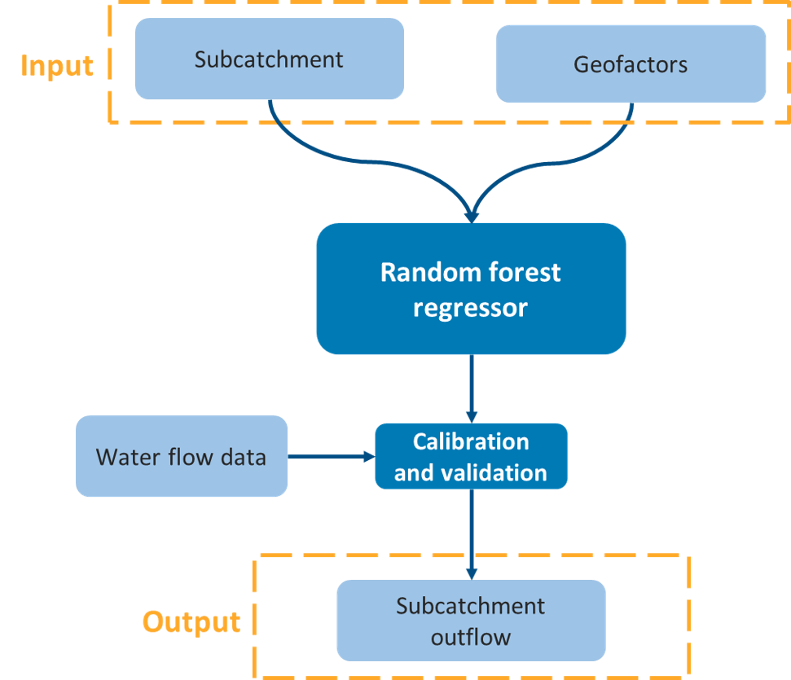
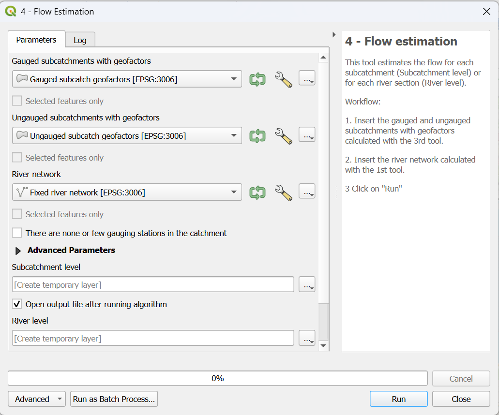

.. _flow-estimation-tool:

Flow Estimation
===============

This tool represents the final step of the workflow, where the actual flow values are estimated. The flow estimation is based on a machine-learning method known as 
Random Forest (`source <https://scikit-learn.org/stable/modules/generated/sklearn.ensemble.RandomForestRegressor.html>`_). In this step, the tool combines the outputs
generated by :ref:`Fix_River` and :ref:`Calculate_Geofactors`. Using these inputs, the model is trained and validated on gauged subcatchments, allowing it to learn 
the relationship between geofactors and flow characteristics. Once trained, the model is applied to ungauged subcatchments to predict their flow behavior.

The resulting outputs include **annual mean flow** and **annual mean low flow**, calculated for each subcatchment or along the river network, depending on the 
selected configuration. :numref:`flow_estimation_scheme-fig` shows a simplified scheme of the model flow.

.. _flow_estimation_scheme-fig:

    
    Simplified scheme of flow estimation process.

Input data
----------
* **gauged_subcatch_geofactors.shp** (from :ref:`Calculate_Geofactors`)
* **ungauged_subcatch_geofactors.shp** (from :ref:`Calculate_Geofactors`)
* **fixed_river_network.shp** (from :ref:`Fix_River`)

Workflow
--------

1. Add all the input data to the project by clicking on "Layer --> Add Layer --> Add Vector Layer"
2. Go in the Processing Toolbox and look for the *APRIORA* plugin. Click on *Flow estimation* and open *4 - Flow Estimation*
3. Choose **gauged_subcatch_geofactors.shp** as input for *Gauged subcatchments with geofactors*
4. Choose **ungauged_subcatch_geofactors.shp** as input for *Ungauged subcatchments with geofactors*
5. Choose **fixed_river_network.shp** as input for *River network*
6. If the catchment has none or few gauging stations, tick the box accordingly
7. Click on *Run*

.. important::
    Video tutorial will be uploaded soon.

    
    Interface of the "Flow estimation" window. 

Output data:

* **subcatchment_level.shp**
* **river_level.shp**

The tool generates two output datasets: one at the subcatchment level and one at the river-section level. Both contain a similar set of
attributes. The newly added flow-related fields are displayed in :numref:`output_data_flow`.

.. _output_data_flow:

.. list-table:: New flow-related fields added to output. 
   :header-rows: 1
   :width: 100%
   :widths: 20 60 20

   * - Column ID
     - Description
     - Unit
   * - Mean_Flow
     - Estimated annual mean flow for the individual river section or subcatchment
     - m³/s
   * - M_Low_Flow
     - Estimated annual mean low flow for the individual river section or subcatchment
     - m³/s
   * - calc_Mean\_
     - Accumulated mean flow, representing the total upstream contribution of mean flow up to the given river section 
     - m³/s
   * - calc_M_Low
     - Accumulated mean low flow, representing the total upstream contribution of mean low flow up to the given river section
     - m³/s     

These outputs can be used for regional water balance assessments, hydrological model initialization, environmental flow studies and downstream analysis
requiring spatially distributed flow estimates.