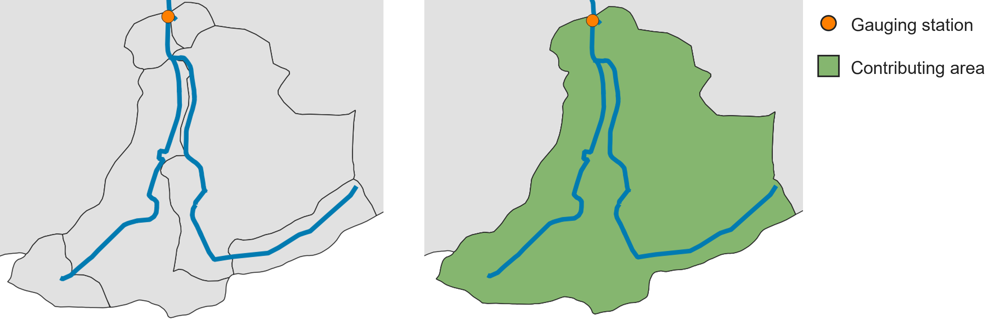
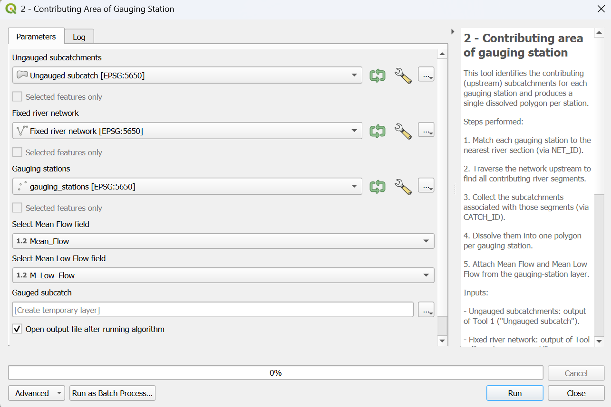

.. _Contributing_Area:

Contributing Area of Gauging Station
====================================

A gauging station measures the flow of a river. However, to understand the flow dynamics, we need to determine the basin area contributing to each gauging station.
This tool allows us to calculate the area upstream each gauging station, which we will use in a later step of the plugin (:numref:`contr_area-fig`).

.. _contr_area-fig:

    
    On the left: a group of subcatchments with a gauging station. On the right: the contributing area of the gauging station (in green) calculated by the tool.

Input data
----------

* **ungauged_subcatchments.shp** (from :ref:`Fix_River`)
* **fixed_river_network.shp** (from :ref:`Fix_River`)
* **gauging_stations.shp**

The first two input data were already discussed previously, so let's talk about the **gauging_stations.shp**. It is a point shapefile representing the 
gauging stations within the catchment. Beside the basic information (like ID, coordinates, etc.), it should contain two columns related to *Mean Flow*
and *Mean Low Flow*. The two average values should be calculated over a certain time series (e.g., 1991 - 2020).
In :numref:`gaug_station_example` , you can see an example of the attribute table of **gauging_stations.shp**.

.. _gaug_station_example:

.. list-table:: Example of attribute table of gauging stations.
    :header-rows: 1
    :widths: 25 30 20 20

    * - gml_id
      - Name
      - Mean Flow
      - Mean Low Flow
    * - ID_1974116
      - Ahrenshagen
      - 1.15200
      - 0.2857
    * - ID_1974265
      - Bützow Gesamt
      - 7.89810
      - 1.72140
    * - ID_1974124
      - Güstrow
      - 3.18780
      - 0.6122
    * - ID_1974292
      - Rostock-Geinitzbrücke
      - 16.00440
      - 2.86670
    * - ID_1974127
      - Wolken
      - 4.64300
      - 0.8783

Workflow
--------

1. Add all the input data to the project by clicking on "Layer --> Add Layer --> Add Vector Layer"
2. Go in the Processing Toolbox and look for the *APRIORA* plugin. Click on *Hydro-Module* and open *2 - Contributing Area of Gauging Station*
3. Choose **ungauged_subcatchments.shp** as input for *Ungauged subcatchments*
4. Choose **fixed_river_network.shp** as input for *Fixed river network*
5. Choose **gauging_stations.shp** as input for *Gauging stations*
6. Select the *Mean Flow* field and *Mean Low Flow* field from **gauging_stations.shp**
7. Click on *Run*

.. important::
    Video tutorial will follow soon.
    

    
    Interface of the "Contributing Area of Gauging Station" window. 

Output data:

* **gauged_subcatchments.shp**

Open the attribute table of **gauged_subcatchments.shp** and check its features. Each feature represents the contributing area for a gauging station. If
there is more than one gauging station, you will notice that the contributing areas are overlapping. If you want to highlight a specific feature, right-click
on it and select *Flash Feature*. Important to notice: there are two extra fields called *Mean_Flow* and *M_Low_Flow* that were directly transferred from **gauging_stations.shp**.
