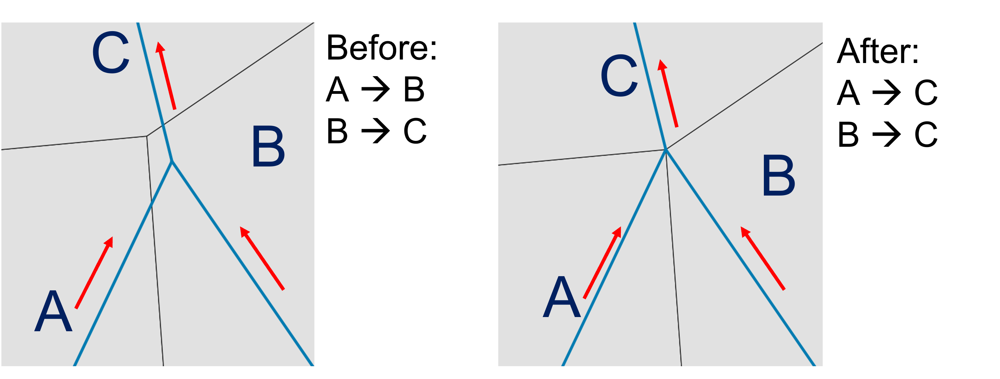
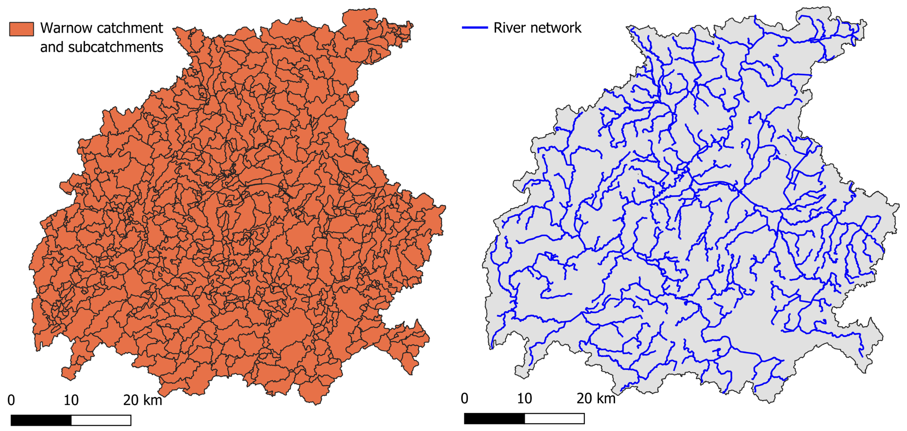
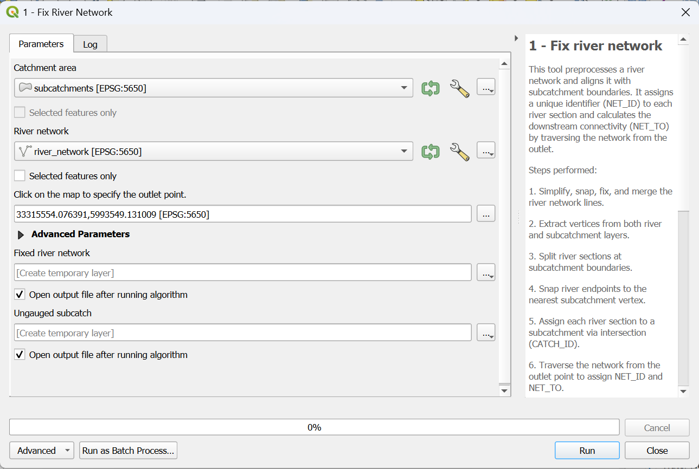

.. _Fix_River:

Fix River Network
=================

Understanding the flow direction (where the water is going and which river section is downstream) is a critical aspect of the river network.
This information is very important for calculating the flow of each river section and determining accumulated values. This tool calculates it and stores it in 
the attribute table of the output through two important columns:

- NET_ID: identification number of the river section
- NET_TO: identification number of the downstream river section

Additionally, it can happen that the intersection between the river network and the subcatchments is not perfectly aligned. This misalignment can cause issues in later 
steps of the plugin, so better fix the input beforehand! We solve it because otherwise the model struggles to understand where the water is flowing and it can cause 
errors or over/under estimation during the flow model like shown in :numref:`fix_riv-fig`.

.. _fix_riv-fig:

    
    On the left: misalignment between river network and subcatchments. On the right: fixed result after running the tool.

If the misalignment is greater than 10 cm, the plugin will not fix it and it is necessary to manually adjust the input file. Check the :ref:`Troubleshooting` section
for more information about it.

Input data
----------
Two input data are necessary for this tool:

* **subcatchments.shp**
* **river_network.shp**

The **subcatchments.shp** is a polygon shapefile that describes the division of the catchment in water basins.
The **river_network.shp** is a line shapefile that represents the river network within the catchment. It is important that all the sections are connected
to each others without gaps. It is also required a precise alignment between the river network and the subcatchments (like already explained above).
For this tool, their attributes are not important, more important is their geometry. An example representing these input data related to the Warnow catchment 
(Germany) can be found in :numref:`fix_riv_input_data-fig`.

.. _fix_riv_input_data-fig:

    
    On the left: example of subcatchment shapefile. On the right: example of river network. 
    Source: https://umweltportal.mv-regierung.de/portale/wschutzgebiete/

Workflow
--------

1. Add all the input data to the project by clicking on "Layer --> Add Layer --> Add Vector Layer"
2. Go in the Processing Toolbox and look for the *APRIORA* plugin. Click on *Hydro-Module* and open *1 - Fix River Network*
3. Choose **subcatchments.shp** as input for *Catchment areas*
4. Choose **river_network.shp** as input for *River network*
5. Click on the three dots and click on the outlet point of the river network. The selected point does not have to be exactly on the outlet, just approximately there.
6. Click on *Run*

.. important::
    Video tutorial will follow soon.

.. .. raw:: html

..    <figure>
..      <video width="700" height="370" controls>
..        <source src="../_static/video/accumulation_2.mp4" type="video/mp4">
..        Your browser does not support the video tag.
..      </video>
..      <figcaption>Video: Worflow of the <i>Accumulation</i> tool.</figcaption>
..    </figure>

    
    Interface of the "Fix River Network" window. 

Output data:

* **fixed_river_network.shp**
* **ungauged_subcatchments.shp**

In **fixed_river_network.shp**, two new columns have been added to the attribute table: NET_ID and NET_TO. These columns, like explained before, represent respectively 
the river network ID of each specific section and the river network ID of the downstream river section. Before we continue, it is important to check if the new colums 
are populated correctly for all river sections. If any value under NET_TO is marked as *unconnected*, it might be due to the fact that the river sections are not connected 
with each others. Check the geometry of the *unconnected* river sections, manually adjust them and re-run the tool until there are no *unconnected* values in the NET_TO column. 
Important: apply the changes to the original file **river_network.shp** and not to **fixed_river_network.shp**.

In the attribute table of **ungauged_subcatchments.shp**, you will find a new column called *CATCH_ID*. This field assigns a unique code to each subcatchment
and river section, making it easier to link subcatchments with their corresponding river section in later steps.
